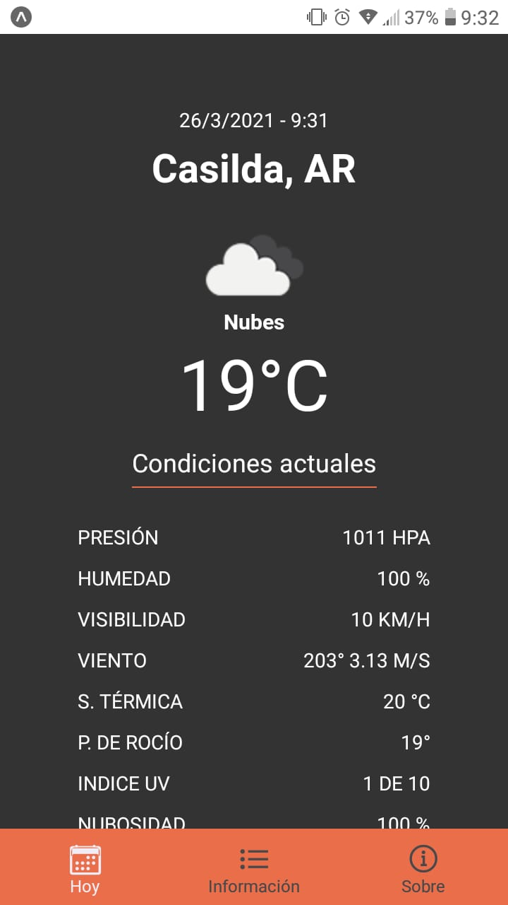

Pronóstico del tiempo por geolocalizacion, con alertas, calidad del aire y extendido de 3 días.
Desarrollado con React native y Expo-cli.

Consume datos de api OpenWeatherMap

## Install

### `Clone repository`
`git clone https://github.com/gabrielcasafu/geoWeather.git`

### `Installing dependencies`
`npm install`

### `Launch`
`expo start`

### `Visualizacion`

